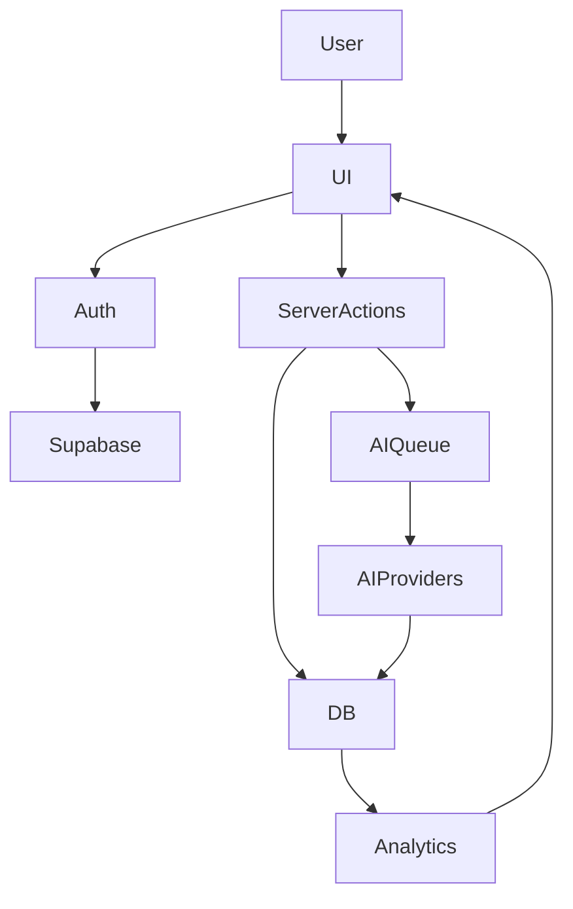

# BlogCraft AI rebuild plan (Next.js-first)

## Decisions locked
- **Auth**: Supabase Auth (email/password + OAuth Google/GitHub).
- **Billing**: Razorpay subscriptions (INR-first), plan entitlements stored in Postgres.
- **Backend**: Next.js App Router + route handlers + server actions for MVP/V1. **FastAPI deferred** until core SaaS is stable.

## Current repo realities to account for
- Existing code includes demo/mock flows (e.g. mock login + mock DB + demo mode fallbacks) and env examples that appear to contain real secrets.
- Existing Next version appears behind your target (Next 15+), and the prompt stack (shadcn, TipTap, Zustand, command palette) needs to be standardized.

## Target architecture (high level)

### Runtime topology
- **Next.js app (Vercel)**
  - Server actions for authenticated mutations (projects, documents, generations, workflows).
  - Route handlers for webhooks (Razorpay), long running job orchestration, exports.
  - Edge middleware for protected routing (lightweight checks), but **real authorization on server**.
- **Supabase**
  - Postgres as source of truth.
  - RLS enforced per workspace/team.
  - Storage buckets for generated images + exports.

### Core data flow

### AI routing design (no “AI wrapper” feel)
- Introduce a single abstraction: `lib/ai/router.ts` that selects **OpenAI primary**, **Gemini fallback**, with:
  - request timeouts + retry budgets
  - content filters / safety checks
  - structured outputs (zod schemas)
  - logging + token accounting to `ai_usage` table
- Keep “agents” as **product features** (ResearchAgent, SEOEngine) with clear outputs stored to DB (not just transient chat).

## Folder structure (target)
- `app/(marketing)/` landing, pricing, docs.
- `app/(auth)/` login/signup/onboarding.
- `app/(app)/dashboard/` workspace shell + pages.
- `components/` shadcn-based UI primitives + app components.
- `lib/`
  - `lib/supabase/` server/client helpers
  - `lib/auth/` session + user/workspace resolution
  - `lib/billing/razorpay/` plans, webhooks, entitlement checks
  - `lib/ai/` provider clients + router + prompt packs
  - `lib/editor/` TipTap extensions, slash commands
  - `lib/seo/` scoring, readability, keyword tools
  - `lib/research/` fetch/summarize, competitor snapshots (defer scraping-heavy parts)
  - `lib/automation/` workflow DSL + scheduler interface
- `db/` SQL migrations (Supabase compatible) + seed.

## Phased delivery (so it becomes usable fast)

### Phase 0 — Security + foundations (must do first)
- Replace any real secrets from example env files; rotate leaked keys.
- Add strict env validation (server vs public) and per-environment configs.
- Upgrade framework and unify UI system: Next 15+, Tailwind, shadcn baseline, dark mode default.

### Phase 1 — MVP “AI Writer OS” (ship-worthy)
**Goal**: a user can sign up, onboard, create a project, write with TipTap, generate/transform text with AI, and export.
- Supabase Auth: email/password + Google/GitHub OAuth.
- Onboarding: niche, style, audience, brand tone, SEO goals → persisted to `brand_profiles`.
- App shell: sidebar nav, command palette, keyboard shortcuts, mobile-first.
- TipTap editor:
  - slash commands
  - inline AI transforms (rewrite/summarize/expand/shorten/tone)
  - content scoring sidebar (readability + basic SEO)
- Projects + documents + version history.
- Export: Markdown + HTML (PDF/DOCX deferred to Phase 2).
- Basic analytics: usage counts, last 7 days activity.

### Phase 2 — SEO Engine + Research Agent (credible differentiation)
**Goal**: the platform feels “enterprise SEO aware” with research-backed outputs.
- SEO engine:
  - keyword density + suggestions
  - headings optimization checklist
  - meta title/description generator
  - snippet preview
  - schema markup generator (Article/FAQ)
- Research agent (pragmatic first pass):
  - curated “sources” input + fetch + summarize
  - competitor snapshot (manual URLs to start)
  - outline generator grounded in summaries
  - question mining via model (no heavy scraping initially)

### Phase 3 — Billing + entitlements (Razorpay)
**Goal**: real subscriptions and quota enforcement.
- Plans: Free/Pro/Business/Enterprise.
- Razorpay checkout + subscription lifecycle.
- Webhooks route handler:
  - verify signature
  - update `subscriptions` and `entitlements`
- Usage limits enforced server-side for AI calls, exports, automations.

### Phase 4 — Automations + publishing integrations
**Goal**: “content operating system” via scheduled workflows.
- Workflow builder (no-code lite): triggers + actions + history.
- Job runner strategy:
  - For MVP: Vercel cron + DB-backed job table.
  - For scale later: move to queue/worker (FastAPI + Redis/BullMQ).
- Integrations: WordPress first (REST), then Medium/Ghost.

### Phase 5 — Teams + real-time collaboration
- Workspaces, roles, invites.
- Comments + approvals.
- Optional real-time presence (Supabase Realtime) for doc editing.

### Phase 6 — AI images + media features
- Image generation (OpenAI Images) + prompt templates.
- Storage + basic image editor (crop/resize/regenerate).

### Phase 7 — FastAPI microservices (when needed)
Move only the parts that benefit:
- long-running research/scraping
- batch generation
- heavy PDF/DOCX rendering
- queue workers

## Database schema (minimum viable tables)
- `users` (optional mirror) + use Supabase `auth.users` as identity.
- `workspaces`, `workspace_members` (roles).
- `brand_profiles` (onboarding + brand memory).
- `projects`, `documents`, `document_versions`.
- `ai_generations` (prompt, model, params, output refs).
- `ai_usage` (tokens/cost, latency, provider, user/workspace).
- `subscriptions`, `entitlements`, `plan_catalog`.
- `workflows`, `workflow_runs`, `workflow_steps`.

## Non-negotiable production requirements
- RLS policies for every multi-tenant table.
- Server-side authorization checks (never trust client).
- Rate limiting for AI endpoints + webhook hardening.
- Observability: structured logs + error tracking.
- Great empty states, loading states, and failure recovery.

## What gets deferred (to avoid a fake “everything” app)
- SERP scraping at scale, Reddit extraction, and heavy competitor crawling (Phase 7).
- Full DOCX/PDF export (Phase 7 or Phase 2 depending on priority).
- Perfect real-time collaborative editing (Phase 5).

## Acceptance criteria for “complete useful tool”
- A stranger can sign up, onboard, create a project, write and improve an article with AI tools, export, and (optionally) upgrade.
- All AI calls are metered, logged, and quota-enforced.
- No demo/mock auth paths remain in production codepaths.
- Secrets are safe; env examples contain placeholders only.
