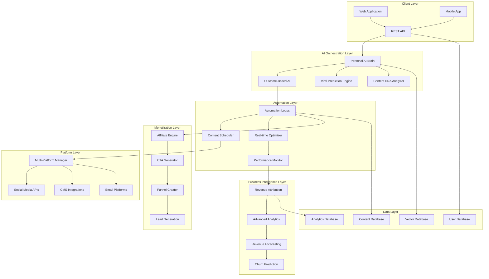

# Revenue/Traffic Engine Transformation - Design Document

## Overview

The Revenue/Traffic Engine transformation represents a fundamental evolution of BlogCraft AI from a content generation tool into a comprehensive business outcome platform. This design outlines the technical architecture for achieving ₹20-30L/month revenue through outcome-based AI, full automation loops, personal AI brain capabilities, and advanced monetization features.

### Vision Statement

Transform BlogCraft AI into an intelligent Revenue/Traffic Engine that guarantees measurable business outcomes through AI-powered automation, predictive analytics, and comprehensive monetization systems.

### Key Transformation Goals

1. **Outcome-Based AI**: Shift from content quality to business results optimization
2. **Full Automation**: End-to-end workflows requiring minimal human intervention
3. **Personal AI Brain**: Adaptive learning system that improves with usage
4. **Revenue Guarantee**: SLA-backed performance guarantees for business outcomes
5. **Premium Positioning**: Enterprise-grade capabilities justifying premium pricing

### Success Metrics

- **Revenue Target**: ₹20-30L/month within 12 months
- **Traffic Guarantee**: 3x traffic growth within 90 days
- **Viral Prediction**: 85%+ accuracy in content virality scoring
- **Automation Efficiency**: 95% reduction in manual content workflow tasks
- **Customer Satisfaction**: 90%+ NPS score from enterprise customers

## Architecture

### System Architecture Overview

The Revenue/Traffic Engine follows a microservices architecture with AI-first design principles, enabling scalable, intelligent automation across all business functions.



### Core Architecture Principles

1. **AI-First Design**: Every component leverages AI for intelligent decision-making
2. **Event-Driven Architecture**: Real-time processing and optimization
3. **Microservices Pattern**: Scalable, maintainable, and independently deployable services
4. **Data-Driven Intelligence**: Comprehensive analytics driving all optimizations
5. **API-First Approach**: Extensible platform supporting integrations and white-label solutions

### Technology Stack

#### Backend Services
- **Runtime**: Node.js with TypeScript for type safety and developer experience
- **Framework**: Next.js 14 with App Router for full-stack capabilities
- **Database**: PostgreSQL for relational data, Redis for caching, Pinecone for vector storage
- **AI/ML**: OpenAI GPT-4, Anthropic Claude, Groq Llama, custom fine-tuned models
- **Queue System**: Bull Queue with Redis for background job processing
- **Search**: Elasticsearch for content search and analytics

#### Frontend
- **Framework**: React 18 with Next.js 14
- **Styling**: Tailwind CSS with custom design system
- **State Management**: Zustand for client state, React Query for server state
- **Charts**: Recharts for analytics visualization
- **Real-time**: WebSockets for live updates

#### Infrastructure
- **Hosting**: Vercel for frontend, Railway/AWS for backend services
- **CDN**: Cloudflare for global content delivery
- **Monitoring**: Sentry for error tracking, DataDog for performance monitoring
- **Analytics**: Custom analytics pipeline with real-time processing

## Components and Interfaces

### 1. Personal AI Brain System

The Personal AI Brain serves as the central intelligence layer that learns, adapts, and optimizes all platform interactions.

#### Core Components

**Memory System**
```typescript
interface PersonalAIBrain {
  userId: string
  preferences: UserPreferences
  successPatterns: SuccessPattern[]
  learningModel: LearningModel
  adaptationHistory: AdaptationRecord[]
}

interface UserPreferences {
  brandVoice: BrandVoice
  contentTypes: ContentTypePreference[]
  targetAudience: AudienceProfile
  businessGoals: BusinessGoal[]
  platformPriorities: PlatformPriority[]
}

interface SuccessPattern {
  patternId: string
  contentType: string
  successMetrics: PerformanceMetrics
  contextFactors: ContextFactor[]
  replicationInstructions: string
}
```

**Learning Engine**
```typescript
interface LearningEngine {
  analyzePerformance(content: Content, metrics: PerformanceMetrics): LearningInsight
  updateModel(insights: LearningInsight[]): ModelUpdate
  predictOptimalStrategy(context: ContentContext): OptimizationStrategy
  adaptToFeedback(feedback: UserFeedback): AdaptationResult
}
```

#### API Interfaces

**Brain Learning API**
```typescript
// POST /api/ai-brain/learn
interface LearnRequest {
  userId: string
  contentId: string
  performanceData: PerformanceMetrics
  userFeedback?: UserFeedback
}

// GET /api/ai-brain/recommendations
interface RecommendationRequest {
  userId: string
  contentType: string
  context: ContentContext
}

interface RecommendationResponse {
  strategy: OptimizationStrategy
  confidence: number
  reasoning: string
  alternatives: AlternativeStrategy[]
}
```

### 2. Outcome-Based AI System

The Outcome-Based AI optimizes for specific business metrics rather than content quality alone.

#### Core Components

**Outcome Optimizer**
```typescript
interface OutcomeBasedAI {
  optimizeForMetric(content: Content, targetMetric: BusinessMetric): OptimizedContent
  predictOutcome(content: Content, context: PublishingContext): OutcomePrediction
  generateVariations(content: Content, optimizationGoals: OptimizationGoal[]): ContentVariation[]
}

interface BusinessMetric {
  type: 'traffic' | 'engagement' | 'conversions' | 'revenue'
  target: number
  timeframe: number
  priority: number
}

interface OutcomePrediction {
  metric: BusinessMetric
  predictedValue: number
  confidence: number
  factors: PredictionFactor[]
  recommendations: OptimizationRecommendation[]
}
```

**Performance Tracking**
```typescript
interface PerformanceTracker {
  trackRealTimeMetrics(contentId: string): Promise<RealTimeMetrics>
  calculateROI(contentId: string): Promise<ROIMetrics>
  attributeRevenue(contentId: string): Promise<RevenueAttribution>
  generatePerformanceReport(timeframe: TimeRange): Promise<PerformanceReport>
}
```

### 3. Viral Prediction Engine

Advanced ML system for predicting content virality with 85%+ accuracy.

#### Core Components

**Viral Scoring System**
```typescript
interface ViralPredictionEngine {
  scoreContent(content: Content): Promise<ViralScore>
  analyzeViralFactors(content: Content): Promise<ViralAnalysis>
  optimizeForVirality(content: Content): Promise<OptimizedContent>
  predictEngagement(content: Content, platform: Platform): Promise<EngagementPrediction>
}

interface ViralScore {
  score: number // 1-100
  confidence: number
  breakdown: {
    emotionalTriggers: number
    structuralElements: number
    timingFactors: number
    audienceAlignment: number
    trendingTopics: number
  }
  optimizationSuggestions: OptimizationSuggestion[]
}

interface ViralAnalysis {
  emotionalTriggers: EmotionalTrigger[]
  hooks: ContentHook[]
  shareabilityFactors: ShareabilityFactor[]
  platformOptimization: PlatformOptimization[]
}
```

**ML Model Architecture**
```typescript
interface ViralMLModel {
  features: FeatureVector
  model: 'transformer' | 'ensemble' | 'neural_network'
  trainingData: TrainingDataset
  accuracy: number
  lastUpdated: Date
}

interface FeatureVector {
  textFeatures: TextFeature[]
  structuralFeatures: StructuralFeature[]
  contextualFeatures: ContextualFeature[]
  temporalFeatures: TemporalFeature[]
}
```

### 4. Automation Loops System

End-to-end automation workflows requiring minimal human intervention.

#### Core Components

**Automation Orchestrator**
```typescript
interface AutomationLoop {
  id: string
  name: string
  trigger: AutomationTrigger
  steps: AutomationStep[]
  conditions: AutomationCondition[]
  schedule: AutomationSchedule
  status: 'active' | 'paused' | 'completed' | 'failed'
}

interface AutomationStep {
  id: string
  type: 'research' | 'generate' | 'optimize' | 'schedule' | 'publish' | 'analyze'
  config: StepConfiguration
  dependencies: string[]
  retryPolicy: RetryPolicy
}

interface AutomationOrchestrator {
  createLoop(definition: AutomationDefinition): Promise<AutomationLoop>
  executeLoop(loopId: string): Promise<ExecutionResult>
  monitorLoop(loopId: string): Promise<LoopStatus>
  optimizeLoop(loopId: string, performanceData: PerformanceData): Promise<OptimizedLoop>
}
```

**Content Pipeline**
```typescript
interface ContentPipeline {
  research: ResearchEngine
  generation: ContentGenerator
  optimization: ContentOptimizer
  scheduling: ContentScheduler
  publishing: ContentPublisher
  analytics: PerformanceAnalyzer
}

interface ResearchEngine {
  analyzeTrends(): Promise<TrendAnalysis>
  analyzeCompetitors(competitors: string[]): Promise<CompetitorAnalysis>
  identifyOpportunities(topic: string): Promise<ContentOpportunity[]>
  generateTopicSuggestions(context: ResearchContext): Promise<TopicSuggestion[]>
}
```

### 5. Monetization Engine

Automated revenue generation through affiliate links, CTAs, and funnel creation.

#### Core Components

**Affiliate Management System**
```typescript
interface AffiliateEngine {
  findRelevantProducts(content: Content): Promise<AffiliateProduct[]>
  insertAffiliateLinks(content: Content, products: AffiliateProduct[]): Promise<MonetizedContent>
  trackConversions(contentId: string): Promise<ConversionMetrics>
  optimizeAffiliateStrategy(performanceData: AffiliatePerformance): Promise<OptimizationStrategy>
}

interface AffiliateProduct {
  id: string
  name: string
  description: string
  commission: number
  relevanceScore: number
  conversionRate: number
  affiliateLink: string
  category: string
}
```

**CTA Generation System**
```typescript
interface CTAGenerator {
  generateCTA(content: Content, goal: ConversionGoal): Promise<CTA>
  optimizeCTA(cta: CTA, performanceData: CTAPerformance): Promise<OptimizedCTA>
  testCTAVariations(cta: CTA): Promise<CTATestResults>
}

interface CTA {
  id: string
  text: string
  type: 'button' | 'link' | 'form' | 'popup'
  placement: CTAPlacement
  design: CTADesign
  targetAction: string
  expectedConversion: number
}
```

**Funnel Creation System**
```typescript
interface FunnelCreator {
  createFunnel(content: Content, goal: BusinessGoal): Promise<SalesFunnel>
  optimizeFunnel(funnelId: string, performanceData: FunnelPerformance): Promise<OptimizedFunnel>
  trackFunnelMetrics(funnelId: string): Promise<FunnelMetrics>
}

interface SalesFunnel {
  id: string
  stages: FunnelStage[]
  conversionGoals: ConversionGoal[]
  automationRules: AutomationRule[]
  performanceMetrics: FunnelMetrics
}
```

### 6. Multi-Platform Domination System

Automated content distribution and optimization across all major platforms.

#### Core Components

**Platform Manager**
```typescript
interface MultiPlatformManager {
  adaptContent(content: Content, platform: Platform): Promise<PlatformContent>
  scheduleContent(content: PlatformContent[], schedule: PublishingSchedule): Promise<ScheduleResult>
  optimizeForPlatform(content: Content, platform: Platform): Promise<OptimizedContent>
  trackCrossPlatformPerformance(contentId: string): Promise<CrossPlatformMetrics>
}

interface Platform {
  name: string
  type: 'social' | 'blog' | 'email' | 'video'
  constraints: PlatformConstraints
  algorithm: AlgorithmProfile
  audience: AudienceProfile
  apiConfig: APIConfiguration
}

interface PlatformConstraints {
  maxLength: number
  supportedFormats: string[]
  imageRequirements: ImageRequirements
  hashtagLimits: number
  postingFrequency: FrequencyLimits
}
```

**Content Adaptation Engine**
```typescript
interface ContentAdapter {
  adaptForTwitter(content: Content): Promise<TwitterContent>
  adaptForLinkedIn(content: Content): Promise<LinkedInContent>
  adaptForInstagram(content: Content): Promise<InstagramContent>
  adaptForYouTube(content: Content): Promise<YouTubeContent>
  adaptForTikTok(content: Content): Promise<TikTokContent>
  adaptForMedium(content: Content): Promise<MediumContent>
}
```

### 7. Revenue Attribution System

Comprehensive analytics system tracking business outcomes and revenue impact.

#### Core Components

**Attribution Engine**
```typescript
interface RevenueAttributionEngine {
  trackContentRevenue(contentId: string): Promise<RevenueAttribution>
  calculateROI(contentId: string, timeframe: TimeRange): Promise<ROICalculation>
  attributeConversions(contentId: string): Promise<ConversionAttribution>
  generateRevenueReport(timeframe: TimeRange): Promise<RevenueReport>
}

interface RevenueAttribution {
  contentId: string
  directRevenue: number
  indirectRevenue: number
  attributionModel: 'first-touch' | 'last-touch' | 'multi-touch'
  conversionPath: ConversionStep[]
  confidence: number
}

interface ConversionStep {
  stepId: string
  contentId: string
  platform: string
  action: string
  timestamp: Date
  value: number
}
```

**Business Intelligence Dashboard**
```typescript
interface BusinessIntelligence {
  generateInsights(data: AnalyticsData): Promise<BusinessInsight[]>
  predictRevenue(timeframe: TimeRange): Promise<RevenueForecast>
  identifyGrowthOpportunities(): Promise<GrowthOpportunity[]>
  analyzeCustomerJourney(customerId: string): Promise<CustomerJourneyAnalysis>
}
```

## Data Models

### Core Data Structures

#### User and Account Management
```typescript
interface User {
  id: string
  email: string
  name: string
  plan: 'free' | 'founder' | 'pro' | 'enterprise'
  subscription: Subscription
  preferences: UserPreferences
  aiPersonality: AIPersonality
  createdAt: Date
  lastActive: Date
}

interface Subscription {
  id: string
  userId: string
  planId: string
  status: 'active' | 'cancelled' | 'past_due' | 'trialing'
  currentPeriodStart: Date
  currentPeriodEnd: Date
  cancelAtPeriodEnd: boolean
  trialEnd?: Date
}

interface AIPersonality {
  userId: string
  learningModel: string
  adaptationLevel: number
  successPatterns: SuccessPattern[]
  preferences: AIPreferences
  lastUpdated: Date
}
```

#### Content Management
```typescript
interface Content {
  id: string
  userId: string
  type: ContentType
  title: string
  body: string
  metadata: ContentMetadata
  status: ContentStatus
  platforms: PlatformContent[]
  performance: PerformanceMetrics
  monetization: MonetizationData
  createdAt: Date
  publishedAt?: Date
}

interface ContentMetadata {
  keywords: string[]
  targetAudience: string
  brandVoice: string
  seoScore: number
  viralScore: number
  readingTime: number
  wordCount: number
  language: string
}

interface PerformanceMetrics {
  views: number
  engagement: number
  shares: number
  comments: number
  clicks: number
  conversions: number
  revenue: number
  roi: number
  lastUpdated: Date
}
```

#### Business Intelligence
```typescript
interface BusinessMetrics {
  userId: string
  period: string
  revenue: RevenueMetrics
  traffic: TrafficMetrics
  engagement: EngagementMetrics
  conversions: ConversionMetrics
  growth: GrowthMetrics
  calculatedAt: Date
}

interface RevenueMetrics {
  totalRevenue: number
  recurringRevenue: number
  oneTimeRevenue: number
  affiliateRevenue: number
  conversionRevenue: number
  revenueGrowth: number
}

interface TrafficMetrics {
  totalTraffic: number
  organicTraffic: number
  socialTraffic: number
  referralTraffic: number
  directTraffic: number
  trafficGrowth: number
}
```

#### Automation and Workflows
```typescript
interface AutomationWorkflow {
  id: string
  userId: string
  name: string
  description: string
  trigger: WorkflowTrigger
  steps: WorkflowStep[]
  schedule: WorkflowSchedule
  status: WorkflowStatus
  metrics: WorkflowMetrics
  createdAt: Date
  lastRun?: Date
}

interface WorkflowStep {
  id: string
  type: StepType
  name: string
  config: StepConfiguration
  conditions: StepCondition[]
  actions: StepAction[]
  order: number
}

interface WorkflowMetrics {
  totalRuns: number
  successfulRuns: number
  failedRuns: number
  averageExecutionTime: number
  lastExecutionTime: number
  contentGenerated: number
  revenueGenerated: number
}
```

### Database Schema Design

#### PostgreSQL Tables

**Users and Authentication**
```sql
CREATE TABLE users (
  id UUID PRIMARY KEY DEFAULT gen_random_uuid(),
  email VARCHAR(255) UNIQUE NOT NULL,
  name VARCHAR(255) NOT NULL,
  plan VARCHAR(50) NOT NULL DEFAULT 'free',
  created_at TIMESTAMP WITH TIME ZONE DEFAULT NOW(),
  updated_at TIMESTAMP WITH TIME ZONE DEFAULT NOW(),
  last_active TIMESTAMP WITH TIME ZONE DEFAULT NOW()
);

CREATE TABLE subscriptions (
  id UUID PRIMARY KEY DEFAULT gen_random_uuid(),
  user_id UUID REFERENCES users(id) ON DELETE CASCADE,
  plan_id VARCHAR(100) NOT NULL,
  status VARCHAR(50) NOT NULL,
  current_period_start TIMESTAMP WITH TIME ZONE NOT NULL,
  current_period_end TIMESTAMP WITH TIME ZONE NOT NULL,
  cancel_at_period_end BOOLEAN DEFAULT FALSE,
  trial_end TIMESTAMP WITH TIME ZONE,
  created_at TIMESTAMP WITH TIME ZONE DEFAULT NOW(),
  updated_at TIMESTAMP WITH TIME ZONE DEFAULT NOW()
);
```

**Content Management**
```sql
CREATE TABLE content (
  id UUID PRIMARY KEY DEFAULT gen_random_uuid(),
  user_id UUID REFERENCES users(id) ON DELETE CASCADE,
  type VARCHAR(50) NOT NULL,
  title TEXT NOT NULL,
  body TEXT NOT NULL,
  metadata JSONB NOT NULL DEFAULT '{}',
  status VARCHAR(50) NOT NULL DEFAULT 'draft',
  performance JSONB NOT NULL DEFAULT '{}',
  monetization JSONB NOT NULL DEFAULT '{}',
  created_at TIMESTAMP WITH TIME ZONE DEFAULT NOW(),
  updated_at TIMESTAMP WITH TIME ZONE DEFAULT NOW(),
  published_at TIMESTAMP WITH TIME ZONE
);

CREATE INDEX idx_content_user_id ON content(user_id);
CREATE INDEX idx_content_type ON content(type);
CREATE INDEX idx_content_status ON content(status);
CREATE INDEX idx_content_created_at ON content(created_at);
```

**AI Brain and Learning**
```sql
CREATE TABLE ai_personalities (
  id UUID PRIMARY KEY DEFAULT gen_random_uuid(),
  user_id UUID REFERENCES users(id) ON DELETE CASCADE UNIQUE,
  learning_model VARCHAR(100) NOT NULL,
  adaptation_level INTEGER NOT NULL DEFAULT 0,
  success_patterns JSONB NOT NULL DEFAULT '[]',
  preferences JSONB NOT NULL DEFAULT '{}',
  created_at TIMESTAMP WITH TIME ZONE DEFAULT NOW(),
  updated_at TIMESTAMP WITH TIME ZONE DEFAULT NOW()
);

CREATE TABLE learning_records (
  id UUID PRIMARY KEY DEFAULT gen_random_uuid(),
  user_id UUID REFERENCES users(id) ON DELETE CASCADE,
  content_id UUID REFERENCES content(id) ON DELETE CASCADE,
  performance_data JSONB NOT NULL,
  insights JSONB NOT NULL,
  adaptations JSONB NOT NULL,
  created_at TIMESTAMP WITH TIME ZONE DEFAULT NOW()
);
```

**Business Intelligence**
```sql
CREATE TABLE business_metrics (
  id UUID PRIMARY KEY DEFAULT gen_random_uuid(),
  user_id UUID REFERENCES users(id) ON DELETE CASCADE,
  period VARCHAR(50) NOT NULL,
  revenue_metrics JSONB NOT NULL DEFAULT '{}',
  traffic_metrics JSONB NOT NULL DEFAULT '{}',
  engagement_metrics JSONB NOT NULL DEFAULT '{}',
  conversion_metrics JSONB NOT NULL DEFAULT '{}',
  growth_metrics JSONB NOT NULL DEFAULT '{}',
  calculated_at TIMESTAMP WITH TIME ZONE DEFAULT NOW()
);

CREATE INDEX idx_business_metrics_user_period ON business_metrics(user_id, period);
CREATE INDEX idx_business_metrics_calculated_at ON business_metrics(calculated_at);
```

#### Vector Database (Pinecone)

**Content Embeddings**
```typescript
interface ContentEmbedding {
  id: string // content_id
  values: number[] // 1536-dimensional embedding
  metadata: {
    userId: string
    contentType: string
    title: string
    keywords: string[]
    performance: number
    viralScore: number
    createdAt: string
  }
}

interface SuccessPatternEmbedding {
  id: string // pattern_id
  values: number[] // embedding of successful content
  metadata: {
    userId: string
    patternType: string
    successMetrics: object
    replicationCount: number
    lastUsed: string
  }
}
```

#### Redis Cache Structure

**Session and Performance Data**
```typescript
interface CacheStructure {
  // User sessions
  [`session:${userId}`]: UserSession
  
  // Real-time metrics
  [`metrics:${contentId}`]: RealTimeMetrics
  
  // AI model predictions
  [`prediction:${contentHash}`]: PredictionResult
  
  // Automation job queues
  [`queue:automation:${workflowId}`]: AutomationJob[]
  
  // Rate limiting
  [`ratelimit:${userId}:${endpoint}`]: RateLimitData
}
```
## Correctness Properties

*A property is a characteristic or behavior that should hold true across all valid executions of a system-essentially, a formal statement about what the system should do. Properties serve as the bridge between human-readable specifications and machine-verifiable correctness guarantees.*

Before defining the correctness properties, I need to analyze the acceptance criteria from the requirements document to determine which are testable as properties.

### Property Reflection

After analyzing all acceptance criteria, I identified several areas where properties can be consolidated to eliminate redundancy:

**Redundant Properties Identified:**
- Requirements 1.2, 7.1, and 15.2 all test viral prediction accuracy - can be combined into one comprehensive property
- Requirements 1.5 and 6.1 both test revenue attribution tracking - can be combined
- Requirements 2.6 and 4.1 both test contextual monetization - can be combined  
- Requirements 4.4 and 12.3 both test sales funnel creation - can be combined
- Requirements 5.1 and 9.2 both test multi-format content generation - can be combined
- Requirements 10.1 and 10.2 both test content analysis for success patterns - can be combined
- Requirements 11.1 and 11.5 both test A/B testing functionality - can be combined

**Properties to Combine:**
- Viral prediction accuracy (1.2, 7.1, 15.2) → Single comprehensive viral prediction property
- Revenue attribution (1.5, 6.1) → Single revenue tracking property
- Contextual monetization (2.6, 4.1) → Single monetization relevance property
- Sales funnel creation (4.4, 12.3) → Single funnel generation property
- Multi-format generation (5.1, 9.2) → Single content adaptation property
- Content analysis (10.1, 10.2) → Single success pattern analysis property
- A/B testing (11.1, 11.5) → Single optimization testing property

This consolidation reduces the total number of properties while maintaining comprehensive coverage of all testable requirements.

### Property 1: Outcome-Based Content Optimization

*For any* content generation request with specific business metric targets (traffic, engagement, conversions, revenue), the generated content should include optimization elements that support those metrics, such as SEO keywords for traffic goals, engagement hooks for engagement goals, CTAs for conversion goals, and monetization elements for revenue goals.

**Validates: Requirements 1.1, 1.7**

### Property 2: Viral Prediction Accuracy and Scoring

*For any* content input, the Viral Prediction Engine should generate a virality score between 1-100 with consistent scoring methodology, provide breakdown of scoring factors (emotional triggers, structural elements, timing, audience alignment, trending topics), and include specific optimization recommendations when scores are below optimal thresholds.

**Validates: Requirements 1.2, 7.1, 7.2, 7.5, 7.6, 15.2**

### Property 3: Adaptive Strategy Adjustment

*For any* content that underperforms against established benchmarks, the Personal AI Brain should automatically generate new strategy recommendations and improved content versions that address the identified performance gaps.

**Validates: Requirements 1.4, 2.4, 2.7**

### Property 4: Revenue Attribution and Tracking

*For any* content with monetization elements, the Revenue Attribution System should accurately track and report direct revenue impact, conversion rates, and ROI calculations with proper attribution to specific content pieces and monetization components.

**Validates: Requirements 1.5, 4.6, 6.1, 6.6, 12.5**

### Property 5: Success Pattern Recognition and Replication

*For any* high-performing content provided for analysis, the Content DNA Analyzer should identify replicable success patterns (structure, hooks, emotional triggers, timing, format) and apply these patterns when generating new content in similar or different contexts.

**Validates: Requirements 1.6, 3.5, 7.4, 7.7, 10.1, 10.2, 10.4, 10.6**

### Property 6: Complete Automation Loop Execution

*For any* automation workflow trigger, the system should execute all steps in the research → generate → design → schedule → analyze → optimize cycle without requiring human intervention, with each step producing valid outputs that serve as inputs for subsequent steps.

**Validates: Requirements 2.1, 2.3**

### Property 7: High-Volume Content Generation Performance

*For any* topic input, the Revenue Engine should generate 30 days of multi-platform content (including multiple formats per platform) within 10 minutes, with all generated content meeting quality and platform-specific requirements.

**Validates: Requirements 2.2, 5.1, 9.2**

### Property 8: Persistent Learning and Memory

*For any* user preferences, brand voice settings, and successful content patterns stored in the Personal AI Brain, the system should retain this information across sessions and automatically apply learned preferences to new content generation without requiring re-input of preferences.

**Validates: Requirements 3.1, 3.2, 3.3**

### Property 9: Performance-Based Model Updates

*For any* performance data provided to the Personal AI Brain, the system should update its internal models to improve future content generation, with measurable improvements in content quality scores and user satisfaction metrics over time.

**Validates: Requirements 2.5, 3.4**

### Property 10: Personalized Recommendation Generation

*For any* user with established success patterns and preferences, the Personal AI Brain should generate personalized recommendations for content topics, formats, and strategies that align with the user's unique success patterns and business goals.

**Validates: Requirements 3.6, 6.5**

### Property 11: Contextual Monetization Integration

*For any* content generated, the Monetization Engine should automatically insert contextually relevant affiliate links, CTAs, and lead magnets that are topically related to the content with high relevance scores, and generate appropriate lead magnets and sales funnels based on content context.

**Validates: Requirements 2.6, 4.1, 4.2, 4.3, 4.4, 12.1, 12.3**

### Property 12: Optimal Platform Scheduling

*For any* content created for multiple platforms, the Traffic Engine should schedule posts at optimal times for each platform based on platform-specific best practices and audience activity patterns, with scheduling times that maximize potential engagement.

**Validates: Requirements 5.2, 7.3**

### Property 13: Real-Time Cross-Platform Performance Tracking

*For any* content published across multiple platforms, the Multi-Platform Domination system should track performance metrics in real-time across all platforms and provide consolidated performance reports with platform-specific insights.

**Validates: Requirements 5.3, 6.2**

### Property 14: Platform-Specific Strategy Adaptation

*For any* performance variations detected across different platforms, the Personal AI Brain should adjust content strategies per platform to optimize for each platform's unique characteristics and algorithm requirements.

**Validates: Requirements 5.4, 5.6**

### Property 15: Automated Brand Voice Engagement

*For any* comments, messages, or engagement opportunities detected across platforms, the Multi-Platform Domination system should generate responses that maintain consistent brand voice and appropriate tone for each platform context.

**Validates: Requirements 5.5**

### Property 16: Viral Content Amplification

*For any* content that achieves viral status (based on engagement thresholds), the Multi-Platform Domination system should automatically initiate amplification strategies across all configured channels to maximize reach and engagement.

**Validates: Requirements 5.7**

### Property 17: Comprehensive Performance Analysis

*For any* content performance analysis request, the Traffic Engine should provide complete analysis including traffic attribution, conversion paths, revenue impact, competitor performance comparison, and content gap identification with actionable insights.

**Validates: Requirements 6.2, 6.4, 6.7**

### Property 18: Revenue Forecasting Accuracy

*For any* content provided for analysis, the Revenue Attribution System should generate revenue forecasts with reasonable confidence intervals and methodology that can be validated against actual performance over time.

**Validates: Requirements 6.3**

### Property 19: Platform-Specific Content Optimization

*For any* content analyzed for different platforms, the Content DNA Analyzer should provide platform-specific recommendations for optimal content length, format, timing, and structural elements that align with each platform's best practices.

**Validates: Requirements 10.3**

### Property 20: Performance Element Correlation

*For any* content with performance data, the Content DNA Analyzer should identify which specific content elements (headlines, hooks, CTAs, images, timing) correlate with highest engagement and conversion rates, providing actionable insights for future content optimization.

**Validates: Requirements 10.5**

### Property 21: Failure Analysis and Improvement

*For any* content that fails to meet performance benchmarks, the Content DNA Analyzer should identify specific failure points (low engagement hooks, poor timing, weak CTAs, etc.) and provide concrete, actionable improvement suggestions.

**Validates: Requirements 10.7**

### Property 22: Automated A/B Testing and Optimization

*For any* content elements that can be optimized (headlines, hooks, CTAs, formats, posting times, monetization approaches), the Revenue Engine should automatically create A/B test variations, manage the testing process, and implement winning variations without manual intervention.

**Validates: Requirements 11.1, 11.2, 11.3, 11.4, 11.5, 11.7**

### Property 23: Content Variation Performance Prediction

*For any* set of content variations provided, the Viral Prediction Engine should predict relative performance rankings and identify which variations are most likely to achieve specific engagement and conversion goals.

**Validates: Requirements 11.6**

### Property 24: Strategic Lead Capture Integration

*For any* content generated, the Monetization Engine should embed strategic lead capture points at optimal locations within the content and create automated email nurturing sequences that guide leads through the conversion funnel.

**Validates: Requirements 12.2, 12.4**

### Property 25: Performance-Based Lead Magnet Optimization

*For any* lead magnets with performance data, the Monetization Engine should optimize lead magnet design, positioning, and offers based on conversion performance, and automatically test and optimize when performance drops below thresholds.

**Validates: Requirements 12.6, 12.7**

### Property 26: Role-Based Access Control

*For any* user assigned to a specific role (strategist, creator, analyst, manager), the Revenue Engine should enforce appropriate access permissions, ensuring users can only access features and data appropriate to their role level.

**Validates: Requirements 13.1**

### Property 27: Collaborative Workflow Management

*For any* content creation and review process, the Revenue Engine should support approval workflows, real-time collaborative editing, commenting, brand guideline enforcement, and custom workflow configurations based on content type and team requirements.

**Validates: Requirements 13.2, 13.4, 13.5, 13.6**

### Property 28: Team Performance Analytics

*For any* team activity and individual contributions, the Revenue Engine should generate comprehensive team performance analytics and individual contributor metrics that provide insights into productivity, content quality, and business impact.

**Validates: Requirements 13.3**

### Property 29: Automated Training and Onboarding

*For any* new team members added to the system, the Revenue Engine should provide automated onboarding processes and training modules that guide users through platform features and best practices based on their assigned role.

**Validates: Requirements 13.7**

### Property 30: Comprehensive API Access

*For any* core functionality available in the user interface, the Revenue Engine should provide equivalent REST API access with proper authentication, rate limiting, and response formatting that enables full platform integration.

**Validates: Requirements 14.1**

### Property 31: Real-Time Data Synchronization

*For any* configured webhook endpoints, the Revenue Engine should send real-time data updates for relevant events (content creation, performance changes, user actions) with reliable delivery and proper error handling.

**Validates: Requirements 14.2**

### Property 32: Third-Party Platform Integration

*For any* supported third-party platform (CRM systems, email marketing platforms, social media tools, analytics platforms), the Revenue Engine should successfully connect, authenticate, and synchronize data bidirectionally while maintaining data integrity.

**Validates: Requirements 14.3, 14.4, 14.5, 14.6**

### Property 33: Zapier Integration Functionality

*For any* Zapier-supported application, the Revenue Engine should provide Zapier integration that enables users to create automated workflows connecting the platform to external applications with proper trigger and action support.

**Validates: Requirements 14.7**

### Property 34: White-Label Configuration

*For any* white-label client configuration, the Revenue Engine should support complete branding customization, custom domain setup, and feature configuration that allows agencies to present the platform as their own solution.

**Validates: Requirements 8.4**

### Property 35: Enterprise API and Integration Support

*For any* enterprise client requirements, the Revenue Engine should provide custom API endpoints, advanced integration capabilities, and enterprise-specific features that support complex business workflows and requirements.

**Validates: Requirements 8.6**

### Property 36: Advanced Team Collaboration Features

*For any* enterprise team using the platform, the Revenue Engine should provide advanced collaboration features including role hierarchies, advanced workflow management, team performance dashboards, and enterprise-grade security controls.

**Validates: Requirements 8.7**

### Property 37: Performance Response Time Guarantee

*For any* core functionality request (content generation, analysis, optimization), the Revenue Engine should respond within 2 seconds under normal operating conditions, with proper error handling and user feedback for any delays.

**Validates: Requirements 15.5**

## Error Handling

### Error Classification System

The Revenue/Traffic Engine implements a comprehensive error handling system that categorizes errors by severity, impact, and recovery strategy.

#### Error Categories

**1. Critical System Errors**
- Database connection failures
- AI service unavailability
- Authentication system failures
- Payment processing errors

**2. Business Logic Errors**
- Invalid content generation parameters
- Monetization rule violations
- Performance threshold breaches
- Workflow execution failures

**3. Integration Errors**
- Third-party API failures
- Social media platform connectivity issues
- Email service provider errors
- Analytics platform sync failures

**4. User Input Errors**
- Invalid content formats
- Missing required parameters
- Exceeded usage limits
- Unauthorized access attempts

#### Error Handling Strategies

**Graceful Degradation**
```typescript
interface ErrorHandlingStrategy {
  primaryService: AIService
  fallbackServices: AIService[]
  degradedMode: DegradedModeConfig
  userNotification: NotificationConfig
}

// Example: AI service failure handling
const contentGenerationErrorHandler = {
  primaryService: 'gpt-4',
  fallbackServices: ['claude-3', 'llama-3.1'],
  degradedMode: {
    enableTemplateGeneration: true,
    reduceComplexity: true,
    cacheResults: true
  },
  userNotification: {
    showFallbackMessage: true,
    offerRetry: true,
    estimateRecoveryTime: true
  }
}
```

**Retry Mechanisms**
```typescript
interface RetryPolicy {
  maxAttempts: number
  backoffStrategy: 'exponential' | 'linear' | 'fixed'
  baseDelay: number
  maxDelay: number
  retryableErrors: ErrorCode[]
}

const defaultRetryPolicy: RetryPolicy = {
  maxAttempts: 3,
  backoffStrategy: 'exponential',
  baseDelay: 1000, // 1 second
  maxDelay: 30000, // 30 seconds
  retryableErrors: ['RATE_LIMIT', 'TIMEOUT', 'SERVICE_UNAVAILABLE']
}
```

**Circuit Breaker Pattern**
```typescript
interface CircuitBreaker {
  failureThreshold: number
  recoveryTimeout: number
  monitoringWindow: number
  state: 'closed' | 'open' | 'half-open'
}

const aiServiceCircuitBreaker: CircuitBreaker = {
  failureThreshold: 5, // Open after 5 failures
  recoveryTimeout: 60000, // 1 minute recovery
  monitoringWindow: 300000, // 5 minute window
  state: 'closed'
}
```

#### Error Recovery Procedures

**Automated Recovery**
1. **Service Health Monitoring**: Continuous monitoring of all critical services
2. **Automatic Failover**: Seamless switching to backup services
3. **Data Consistency Checks**: Validation of data integrity after recovery
4. **Performance Restoration**: Gradual return to full functionality

**Manual Recovery Procedures**
1. **Incident Response Team**: 24/7 on-call engineering team
2. **Escalation Procedures**: Clear escalation paths for different error types
3. **Communication Protocols**: User notification and status page updates
4. **Post-Incident Analysis**: Root cause analysis and prevention measures

#### User Experience During Errors

**Transparent Communication**
- Clear error messages explaining what happened
- Estimated recovery times when available
- Alternative actions users can take
- Real-time status updates

**Functionality Preservation**
- Core features remain available during partial outages
- Cached data serves as fallback for real-time features
- Offline mode for content creation and editing
- Automatic sync when services recover

## Testing Strategy

### Dual Testing Approach

The Revenue/Traffic Engine employs a comprehensive testing strategy that combines unit testing for specific scenarios with property-based testing for universal correctness guarantees.

#### Unit Testing Strategy

**Focus Areas for Unit Tests:**
- **Specific Examples**: Concrete test cases that demonstrate correct behavior
- **Edge Cases**: Boundary conditions and unusual input scenarios
- **Error Conditions**: Failure modes and error handling paths
- **Integration Points**: Component interactions and data flow validation
- **Business Logic**: Complex algorithms and decision-making processes

**Unit Test Categories:**

1. **Component Unit Tests**
   - Individual function and method testing
   - Mock external dependencies
   - Test specific business logic paths
   - Validate error handling

2. **Integration Tests**
   - API endpoint testing
   - Database interaction validation
   - Third-party service integration
   - Cross-component communication

3. **End-to-End Tests**
   - Complete user workflow validation
   - Multi-step process testing
   - Real-world scenario simulation
   - Performance under load

#### Property-Based Testing Strategy

**Property-Based Testing Configuration:**
- **Testing Library**: fast-check for TypeScript/JavaScript
- **Minimum Iterations**: 100 iterations per property test
- **Test Tagging**: Each property test references its design document property
- **Tag Format**: `// Feature: revenue-traffic-engine-transformation, Property {number}: {property_text}`

**Property Test Implementation:**

```typescript
import fc from 'fast-check'

// Example property test for content optimization
describe('Outcome-Based Content Optimization', () => {
  it('should optimize content for specified business metrics', () => {
    // Feature: revenue-traffic-engine-transformation, Property 1: Outcome-Based Content Optimization
    fc.assert(fc.property(
      fc.record({
        topic: fc.string({ minLength: 10, maxLength: 100 }),
        targetMetric: fc.constantFrom('traffic', 'engagement', 'conversions', 'revenue'),
        audience: fc.string({ minLength: 5, maxLength: 50 }),
        brandVoice: fc.constantFrom('professional', 'casual', 'technical', 'creative')
      }),
      async (contentRequest) => {
        const optimizedContent = await outcomeBasedAI.optimizeForMetric(
          contentRequest.topic,
          contentRequest.targetMetric,
          contentRequest.audience,
          contentRequest.brandVoice
        )

        // Verify optimization elements are present
        switch (contentRequest.targetMetric) {
          case 'traffic':
            expect(optimizedContent.seoKeywords).toBeDefined()
            expect(optimizedContent.seoKeywords.length).toBeGreaterThan(0)
            break
          case 'engagement':
            expect(optimizedContent.engagementHooks).toBeDefined()
            expect(optimizedContent.engagementHooks.length).toBeGreaterThan(0)
            break
          case 'conversions':
            expect(optimizedContent.ctas).toBeDefined()
            expect(optimizedContent.ctas.length).toBeGreaterThan(0)
            break
          case 'revenue':
            expect(optimizedContent.monetizationElements).toBeDefined()
            expect(optimizedContent.monetizationElements.length).toBeGreaterThan(0)
            break
        }

        // Verify content quality
        expect(optimizedContent.content).toBeDefined()
        expect(optimizedContent.content.length).toBeGreaterThan(100)
        expect(optimizedContent.title).toBeDefined()
      }
    ), { numRuns: 100 })
  })
})

// Example property test for viral prediction
describe('Viral Prediction Accuracy and Scoring', () => {
  it('should provide consistent viral scoring with breakdown', () => {
    // Feature: revenue-traffic-engine-transformation, Property 2: Viral Prediction Accuracy and Scoring
    fc.assert(fc.property(
      fc.record({
        content: fc.string({ minLength: 100, maxLength: 2000 }),
        platform: fc.constantFrom('twitter', 'linkedin', 'instagram', 'facebook'),
        contentType: fc.constantFrom('blog', 'social', 'video', 'email')
      }),
      async (input) => {
        const viralScore = await viralPredictionEngine.scoreContent(
          input.content,
          input.platform,
          input.contentType
        )

        // Verify score is in valid range
        expect(viralScore.score).toBeGreaterThanOrEqual(1)
        expect(viralScore.score).toBeLessThanOrEqual(100)

        // Verify breakdown components exist
        expect(viralScore.breakdown).toBeDefined()
        expect(viralScore.breakdown.emotionalTriggers).toBeGreaterThanOrEqual(0)
        expect(viralScore.breakdown.structuralElements).toBeGreaterThanOrEqual(0)
        expect(viralScore.breakdown.timingFactors).toBeGreaterThanOrEqual(0)
        expect(viralScore.breakdown.audienceAlignment).toBeGreaterThanOrEqual(0)
        expect(viralScore.breakdown.trendingTopics).toBeGreaterThanOrEqual(0)

        // Verify optimization suggestions for low scores
        if (viralScore.score < 70) {
          expect(viralScore.optimizationSuggestions).toBeDefined()
          expect(viralScore.optimizationSuggestions.length).toBeGreaterThan(0)
        }

        // Verify confidence score
        expect(viralScore.confidence).toBeGreaterThanOrEqual(0)
        expect(viralScore.confidence).toBeLessThanOrEqual(1)
      }
    ), { numRuns: 100 })
  })
})
```

#### Test Coverage Requirements

**Minimum Coverage Targets:**
- **Unit Tests**: 90% code coverage
- **Integration Tests**: 85% API endpoint coverage
- **Property Tests**: 100% correctness property coverage
- **End-to-End Tests**: 80% critical user journey coverage

**Coverage Monitoring:**
- Automated coverage reporting in CI/CD pipeline
- Coverage regression prevention
- Regular coverage audits and improvements
- Integration with code review process

#### Performance Testing

**Load Testing Strategy:**
- **Concurrent Users**: Test with up to 1000 concurrent users
- **Content Generation**: Validate performance under high content generation load
- **API Response Times**: Ensure sub-2-second response times under load
- **Database Performance**: Monitor query performance and optimization

**Stress Testing:**
- **Peak Load Simulation**: Test 3x normal traffic levels
- **Resource Exhaustion**: Test behavior under resource constraints
- **Failure Recovery**: Test system recovery after failures
- **Data Consistency**: Validate data integrity under stress

#### Continuous Testing Pipeline

**Automated Testing Workflow:**
1. **Pre-commit Hooks**: Run unit tests and linting
2. **Pull Request Validation**: Full test suite execution
3. **Staging Deployment**: Integration and E2E testing
4. **Production Monitoring**: Continuous health checks and performance monitoring

**Test Data Management:**
- **Synthetic Data Generation**: Automated test data creation
- **Data Privacy**: Anonymized production data for testing
- **Test Environment Isolation**: Separate test databases and services
- **Data Cleanup**: Automated test data cleanup procedures

This comprehensive testing strategy ensures that the Revenue/Traffic Engine maintains high quality, reliability, and performance while supporting rapid development and deployment cycles. The combination of unit tests for specific scenarios and property-based tests for universal correctness provides robust validation of all system behaviors and business requirements.